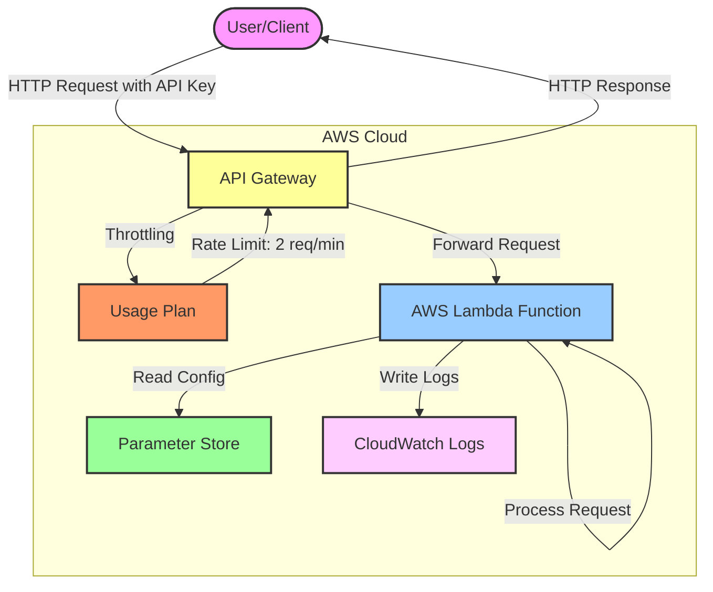
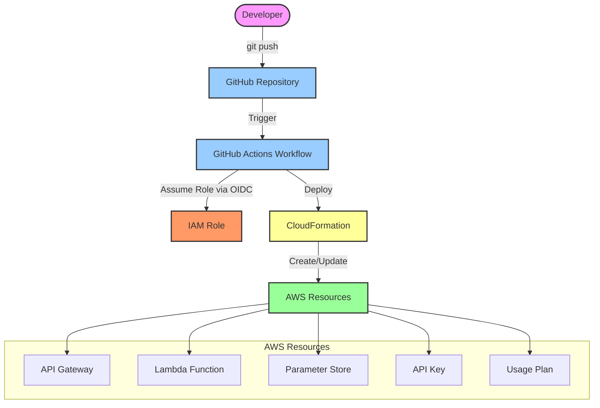
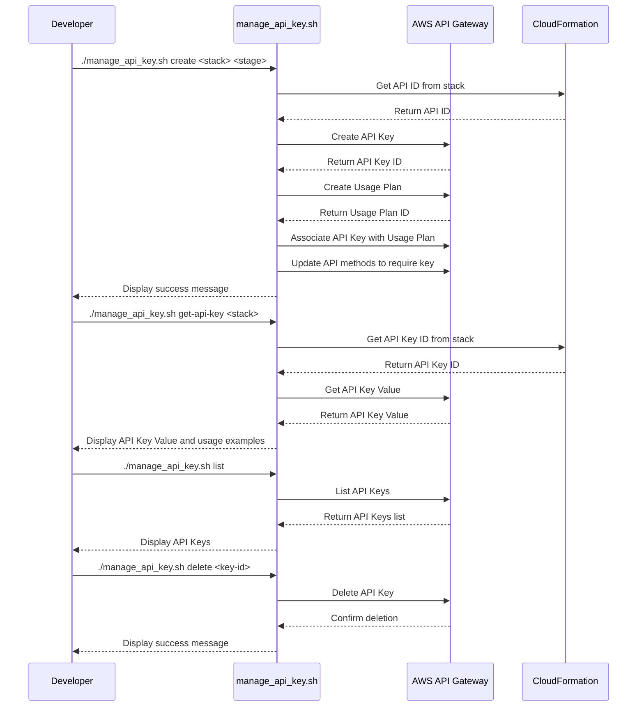
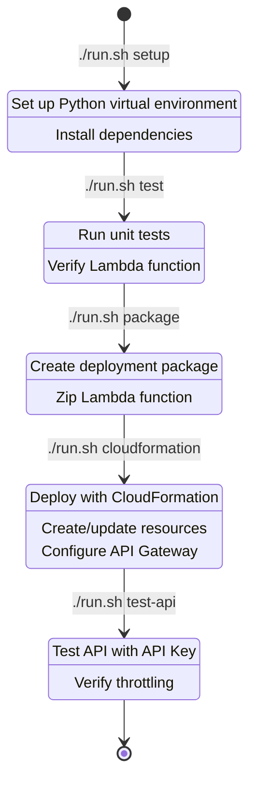
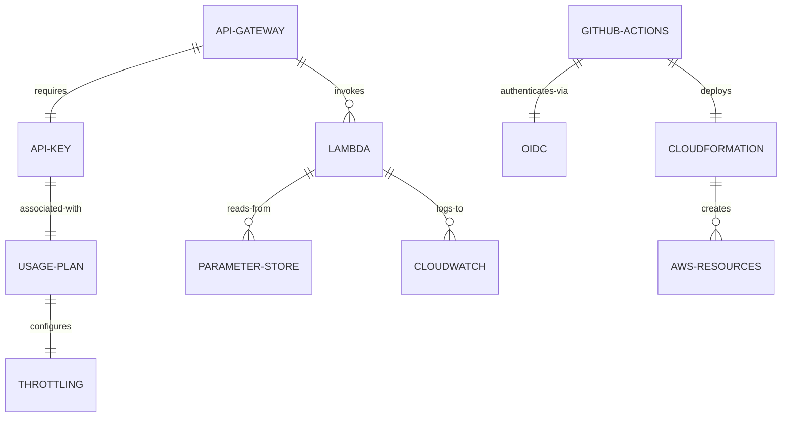
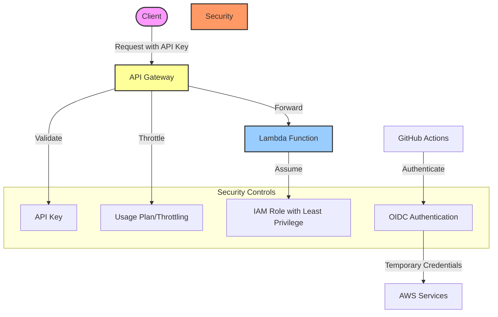
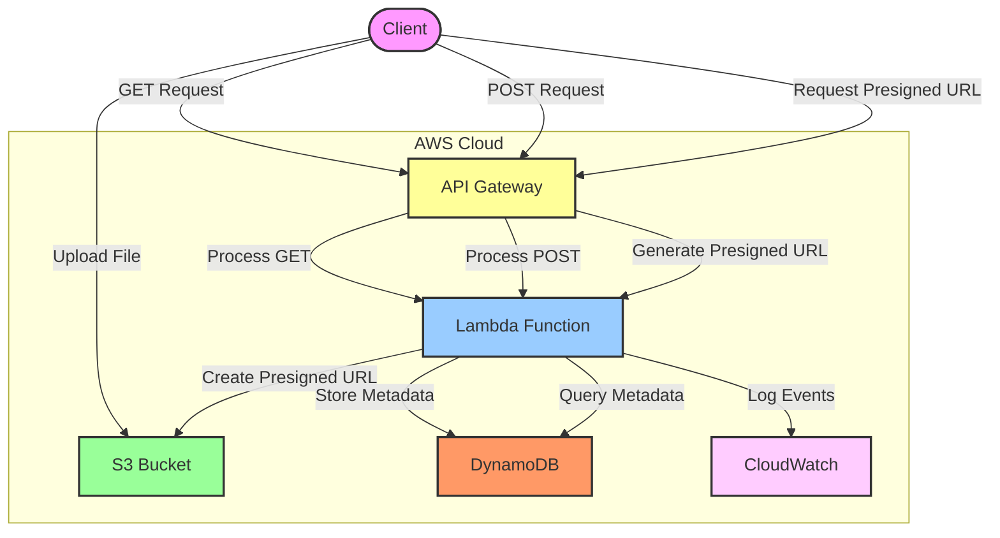
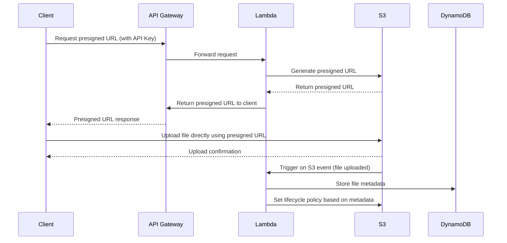

# Hello World API Architecture Diagrams

This document provides visual representations of the Hello World API architecture using Mermaid diagrams.

## System Architecture

## Deployment Architecture

## API Key Management Workflow

## Deployment Process

## Component Relationships

## Security Architecture

## Planned Enhancements Architecture

## File Upload Sequence

